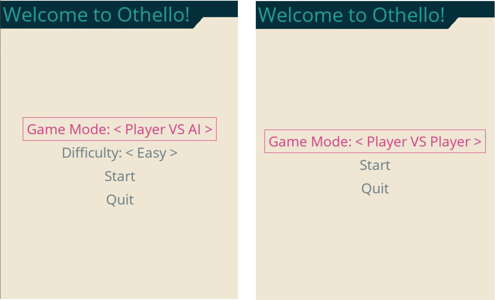
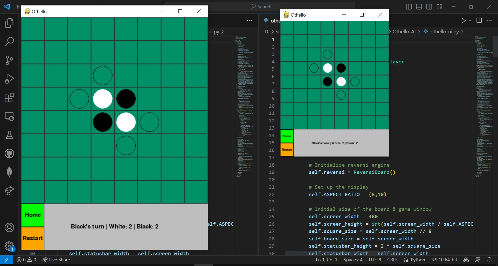
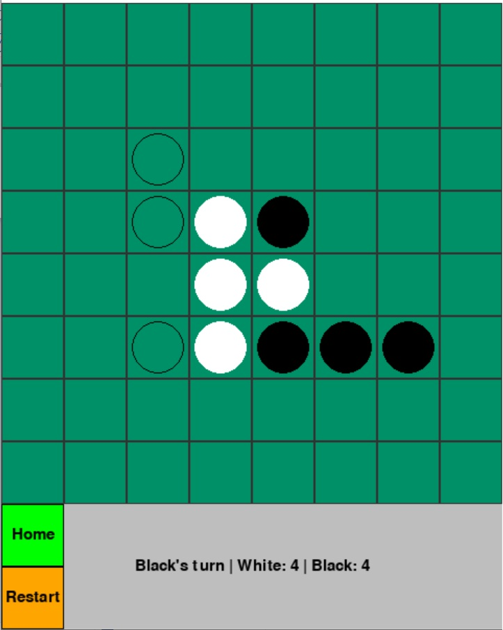
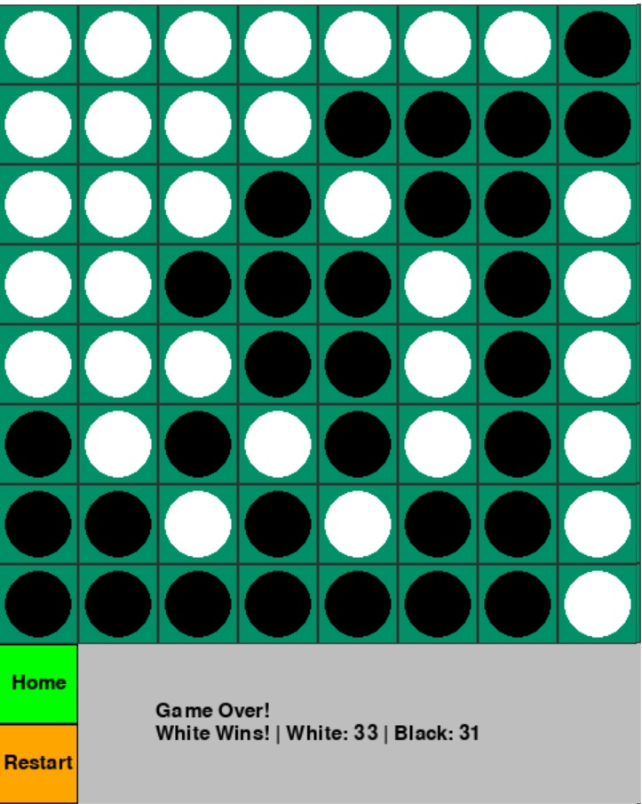

# Othello-AI

This is a project for Artificial Intelligence 🤖 course CSE472 at ASU-FE.

## Table of Contents
- [Othello-AI](#othello-ai)
  - [Table of Contents](#table-of-contents)
  - [Introduction](#introduction)
  - [Game Description](#game-description)
  - [Algorithms](#algorithms)
    - [Game-Palying Algorithms](#game-palying-algorithms)
    - [Heuristics](#heuristics)
  - [The GUI](#the-gui)
  - [User Manual](#user-manual)
    - [Run From Source](#run-from-source)
    - [Run From Executable](#run-from-executable)
    - [Game Manual](#game-manual)
  - [Contributors](#contributors)


## Introduction

The project is an implementation of Othello (aka. Reversi) game 🎮 with an AI engine. 

In this project, we will explore the game playing of Othello using search algorithms and heuristics. Othello is a two-player strategy game played on a 8x8 board, where each player has pieces that are either black or white. The goal of the game is to have the most pieces of your color on the board at the end of the game.

The project is fully implemented using Python language.

[](https://www.python.org)


For more information about the game, please refer to [Wikipedia](https://en.wikipedia.org/wiki/Reversi) 🌐.

For game rules, you can watch this [video](https://www.youtube.com/watch?v=zFrlu3E18BA) 📺.

## Game Description

The game has 3 modes with different difficulty levels:


| Game Mode |
| --- |
| Human vs Human |
| Human vs AI |
| AI vs AI |


Both of the AI modes has 3 difficulty levels:

| Difficulty Level | 
| --- |
| Easy |
| Medium |
| Hard |

## Algorithms

### Game-Palying Algorithms

The game algorithms used in this project are:

1. The minimax algorithm: a basic search algorithm that examines all possible moves from a given position and selects the move that leads to the best outcome for the current player

2. Alpha-beta pruning: an improvement on the minimax algorithm that can reduce the number of nodes that need to be searched.

3. Alpha-beta pruning with iterative deepening (depth is increased iteratively in the search
tree until the timing constraints are violated)

The Algorithms are implemented in [alphaBetaPruning.py](./backend/alphaBetaPruning.py) and [MinMax.py](./backend/MinMax.py).

### Heuristics

The heuristics function is a collection of more than one heuristic that mainly calculates the utility value of a position in the board and gives different weights to those heuristics and determines how good a particular state is for the player. 

The heuristics used respectively according to weights: 

1. Corners Captured
2. Mobility
3. Coin Parity
4. Stability

## The GUI

The GUI is implemented using [PyGame](https://www.pygame.org/news) 🐍🎮 and [pygame-menu](https://pygame-menu.readthedocs.io/en/latest/) 📃.

[](https://badge.fury.io/py/pygame) [](https://badge.fury.io/py/pygame-menu)

GUI main functions are implemented in [othello_ui.py](./othello_ui.py).

## User Manual

### Run From Source

1. Clone the repo

```bash
git clone https://github.com/MahmoudAAbdelkader/Othello-AI.git

cd Othello-AI/
```

2. Install the requirements

```bash
pip install -r requirements.txt
```

3. Run the game

```bash
python othello_ui.py
```

### Run From Executable

1. Link to download Executable
   https://drive.google.com/file/d/1BXqDuNrmxMqsOJjRYG02ambU2Jkqq62a/view

### Game Manual

1. Choose the game mode and difficulty level



2. You Can resize the window as you like



3. The Game has indicators for the valid moves as hollow circles
4. There is a status bar (score board) that shows whose turn is it and both players' scores
5. The game has **Home** & **Restart** buttons



6. At the game end, the winner is announced



7. Enjoy the game! 😅 


## Contributors


| Thanks for your contributions! 🎉🎉🎉 |
| --- |
| <div style="display: flex; align-items: center;"><div style="margin-left: 10px;"><a href="https://github.com/hussameldin171">Hussam ElDin Wael</a></div></div> |
| <div style="display: flex; align-items: center;"><div style="margin-left: 10px;"><a href="https://github.com/hishamyakan">Hisham Yakan</a></div></div> |
| <div style="display: flex; align-items: center;"><div style="margin-left: 10px;"><a href="https://github.com/NadaAmgadSayed">Nada Amgad</a></div></div> |
| <div style="display: flex; align-items: center;"><div style="margin-left: 10px;"><a href="https://github.com/NadaYousseff">Nada Youssef</a></div></div> |
| <div style="display: flex; align-items: center;"><div style="margin-left: 10px;"><a href="https://github.com/AhmedAlaa50">Ahmed Alaa</a></div></div> |
| <div style="display: flex; align-items: center;"><div style="margin-left: 10px;"><a href="https://github.com/MahmoudAAbdelkader">Mahmoud Abdelkader</a></div></div> |
| <div style="display: flex; align-items: center;"><div style="margin-left: 10px;"><a href="https://github.com/Mo3az2000">Moaaz Hamdy</a></div></div> |
